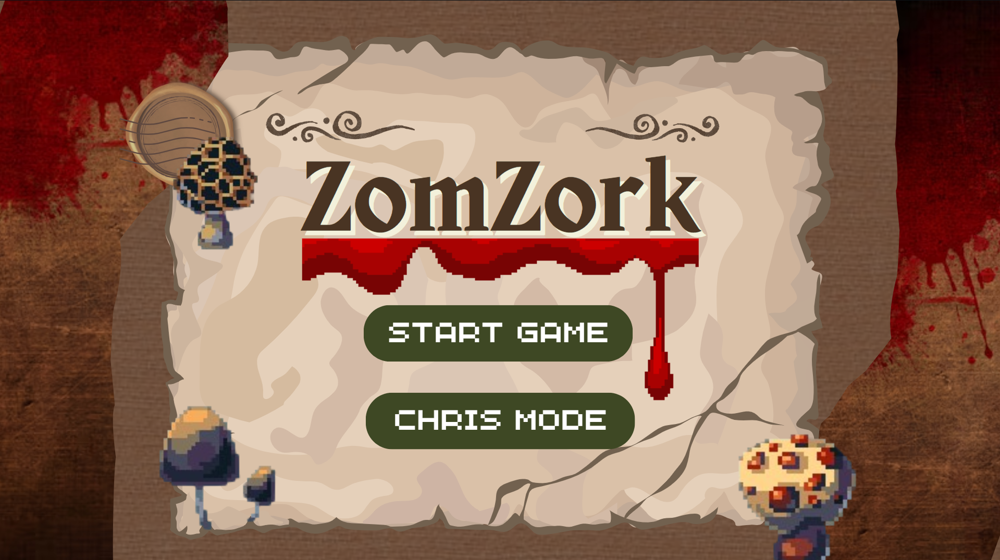
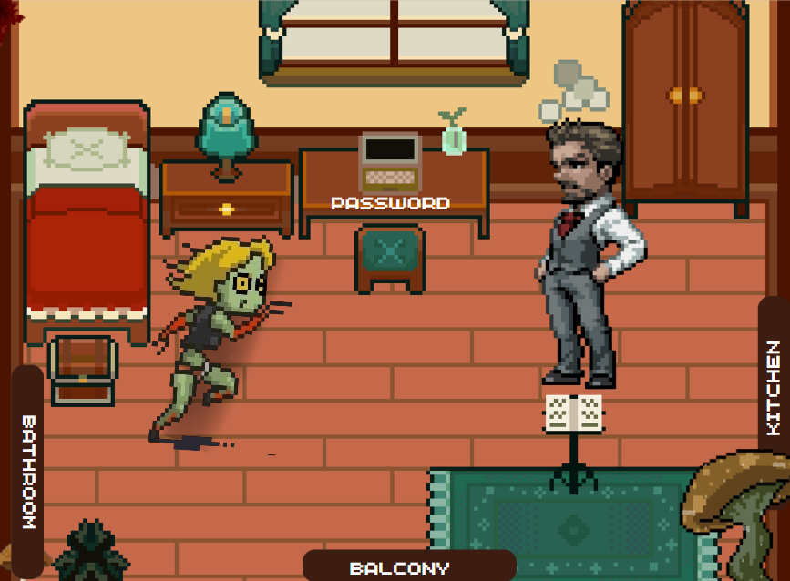
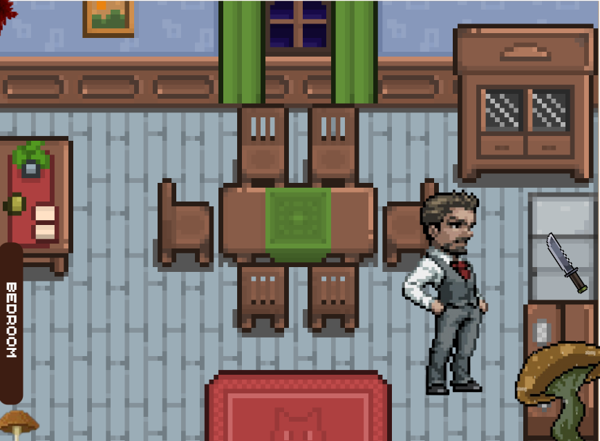
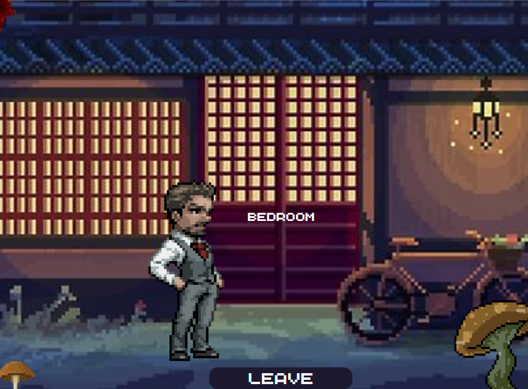

# ZomZork

> A zombie-themed, Zork-inspired adventure game built with C++ and Qt.

<p align="center">
  
</p>

## About

ZomZork reimagines the classic text-based adventure game [Zork](https://en.wikipedia.org/wiki/Zork) as a fully graphical point-and-click experience. Instead of typing commands into a terminal, players navigate rooms, collect items, and make story-altering decisions through an interactive GUI with clickable environments and directional controls.

The game follows a horror/mystery storyline: you wake up disoriented in your bedroom with no memory of recent events. Your wife lies on the floor, seemingly infected with a mysterious virus. You must explore your surroundings, gather items, solve puzzles, and ultimately escape — if you make the right choices.

### Design Inspiration

The GUI and gameplay design draws from:

- **[Zork](https://en.wikipedia.org/wiki/Zork)** — The foundational text adventure: room-based exploration, inventory management, and player agency
- **[Fear & Hunger](https://store.steampowered.com/app/1002300/Fear__Hunger/)** — Dark, atmospheric horror with consequential decision-making
- **[OMORI](https://www.omori.com/)** — Bird's-eye perspective, psychological narrative, and multiple endings

The goal was to preserve what makes Zork compelling — exploration, choice, and consequence — while replacing the text parser with visual interaction: clickable objects, arrow-based navigation, and an immersive room-by-room GUI.

## Gameplay

### Exploration

Navigate through **6 interconnected rooms** using directional buttons (or WASD keys):

```
                    ┌───────────┐
                    │  Bathroom │
                    └─────┬─────┘
                          │ East
        ┌─────────┐     ┌┴──────────┐     ┌─────────┐
        │ Kitchen ├──W──┤  Bedroom  ├──S──┤ Balcony │
        └─────────┘     └───────────┘     └────┬────┘
                                               │ South
                                        ┌──────┴──────┐
                                        │Train Station│
                                        └──────┬──────┘
                                               │ West
                                        ┌──────┴──────┐
                                        │ Train Inside│
                                        └─────────────┘
```

### Items & Inventory

Discover and collect up to **3 items** by clicking on interactive objects within rooms:

| Item | Location | Description |
|------|----------|-------------|
| Pills | Bathroom | Mysterious pills found on the floor |
| Knife | Kitchen | A knife that might prove useful later |
| Key | Bedroom (puzzle reward) | Unlocks the balcony door |

### Puzzle

The bedroom contains a locked puzzle — solve it by entering the correct 3-digit code to obtain the key and unlock further progression.

### Room Previews

<p align="center">
  
  
  
</p>

## Tech Stack

| Component | Technology |
|-----------|-----------|
| Language | C++17 |
| GUI Framework | Qt 5 / Qt 6 |
| Build System | CMake 3.5+ |
| UI Layout | Qt Designer (`.ui` files) |
| Assets | Qt Resource System (`.qrc`) |

## Project Structure

```
ZomZorkProject/
└── ZomZork/
    ├── CMakeLists.txt          # Build configuration
    ├── main.cpp                # Application entry point
    ├── mainwindow.h/cpp/ui     # Main game window & GUI logic
    │
    ├── room.h/cpp              # Room class — connections & navigation
    ├── Entity.h/cpp            # Abstract base entity (Identity + Description)
    ├── item.h/cpp              # Collectible items (inherits Entity)
    ├── Inventory.h/cpp         # 3-slot inventory system
    ├── PlayerStats.h/cpp       # Player combat stats & attack types
    ├── RoomStory.h/cpp         # Narrative text for each room
    │
    ├── Identity.h              # Abstract interface — entity identification
    ├── Description.h           # Abstract interface — entity descriptions
    ├── TemplateArray.h/cpp     # Generic template-based dynamic array
    ├── CustomExceptions.h      # Custom exception classes
    │
    ├── Images.qrc              # Qt resource manifest
    └── *.png                   # Room backgrounds & item icons
```

### OOP Concepts Used

- **Inheritance** — `Item` inherits from `Entity`, which inherits from `Identity` and `Description`
- **Polymorphism** — Abstract interfaces with pure virtual functions
- **Encapsulation** — Private members with public accessor methods
- **Templates** — Generic `TemplateArray<T>` container class
- **Bit-fields** — Compact memory representation for item weight
- **Unions** — Polymorphic attack type storage in `PlayerStats`
- **Exception Handling** — Custom exceptions for invalid room access

## Building & Running

### Prerequisites

- **CMake** 3.5 or higher
- **Qt** 5 or 6 (Widgets module)
- A C++ compiler supporting **C++17** (GCC, Clang, or MSVC)

### Build

```bash
cd ZomZork
cmake -B build
cmake --build build
```

### Run

```bash
# macOS
open build/ZomZork.app

# Linux / Windows
./build/ZomZork
```

## License

This project was developed as a Final Year Project (FYP).
